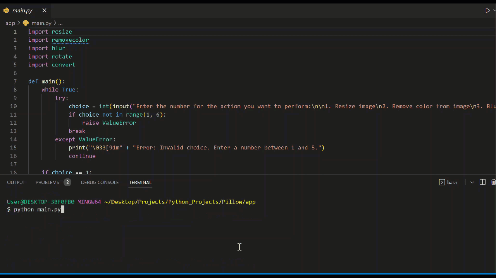

# Image Conversion Tool

>This is a Python-based command-line tool for image conversion, resizing, blurring, rotation, and black and white conversion. Users can choose from different options by inputting a number, and the tool will perform the corresponding image processing operation.




- Blur Image: Enter blur radius
- Convert Image: bmp, png, jpeg, webp
- Remove color from image
- Resize Image: Enter custom size
- Rotate Image: 90 degrees clockwise, 90 degrees counter-clockwise, 180 degrees, custom angle

## Demo
## Quick Start

#
1: Install the dependencies:

```bash
pip install pillow 
```

#
2: Change Dir:
```bash
cd into the 'app' folder
```

#
3 Run:
```bash
python main.py
````

## License

MIT © [iAlex0](https://github.com/ialex0)